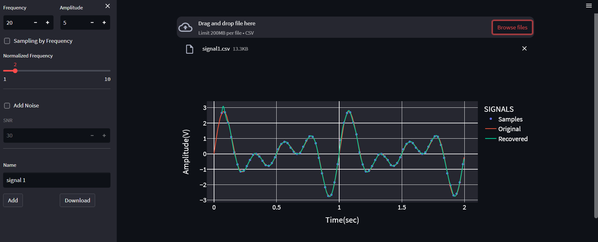
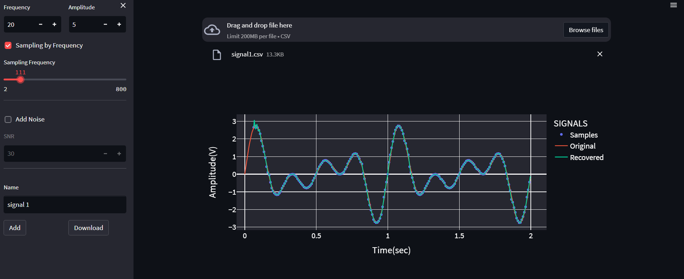
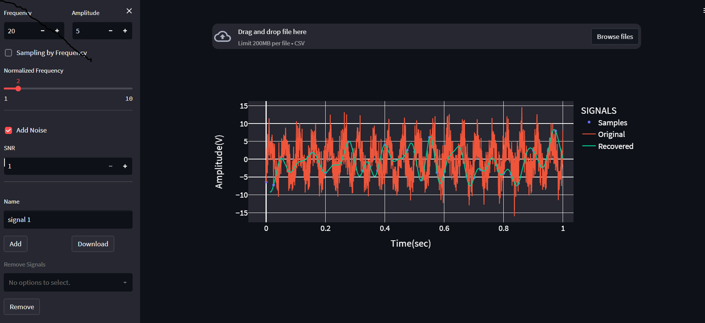
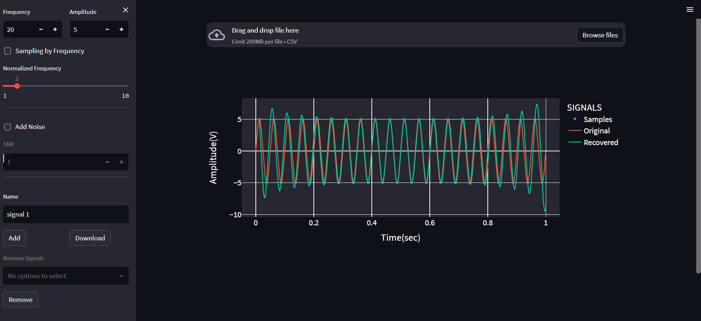
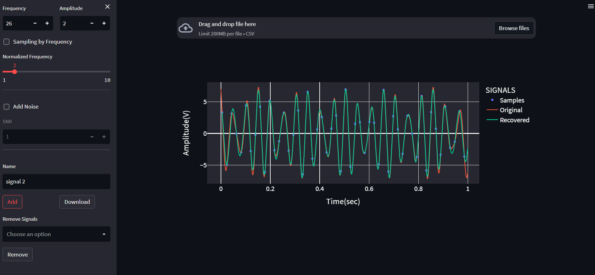

# Sampling-Studio

- [Sampling-Studio](#sampling-studio)
  - [Task-Info.](#task-info)
  - [Description](#description)
  - [Features](#features)
  - [Demos](#demos)
  - [Run-App](#run-app)

## Task-Info. 
- This course is about _Digital Signal Processing_ for Third-year of Department of Medical Engineering, first semester on **1st Nov.2022**
- Members who participated in the work of this project:
  | Names           | Section | Bench Number |
  | --------------- | ------- | ------------ |
  | Amr Muhammed    |    2    |      7       |
  | Abdelrahman Ali |    1    |     55       |
  | Ereny Eleya     |    1    |     19       |
  | Kareman yasser  |    2    |     9        |
  
## Description
   This is a web app for sampling, reconstruction and composing signals.
## Features
- Developing an illustrator for the signal recovery that shows Nyquist rate.
- Highlight the sampled points on top of the original signal.
- Change the sampling frequency via a slider that range from 1 to 10 fmax (normalized freqency) or from 1 to 800 HZ
- Reconstruct/recover the signal from the sampled points.
- Adding noise to the signal by SNR to see the effect of noise on the sampling and recovery of the signal
- Composing signals together via the add button and removing selected signals from the sum of signals  illustrating the results on the graph
- After making a synthetic signal then moving it to the main illustrator graph to start the sampling/recovery process.
## Demos

1. Uploading, sampling and recovering a signal 



2. Sampling a signal by frequency 


3. Adding noise to the signal 


4. Generating, sampling and recovering a signal using normalized frequency



5. Compose 2 signals




## Run-App
1. **_install project dependencies_**
```sh
pip install -r requirements.txt
```
2. **_Run the application_**
```sh
python main.py
